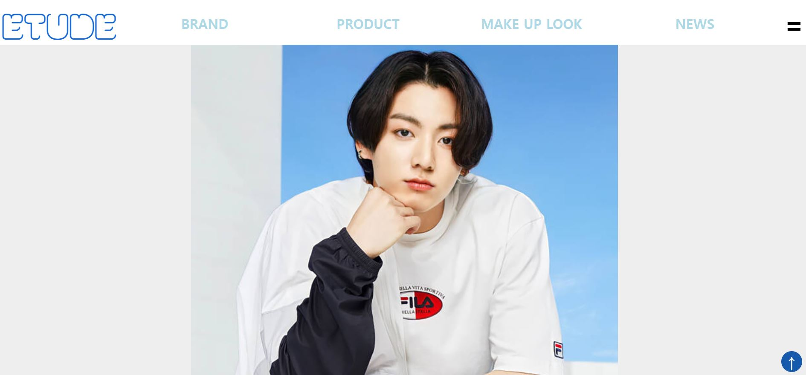
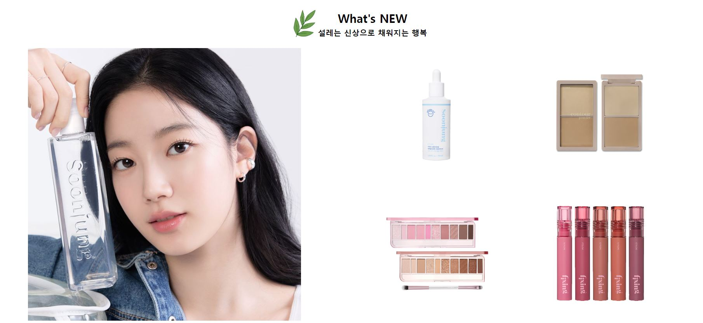
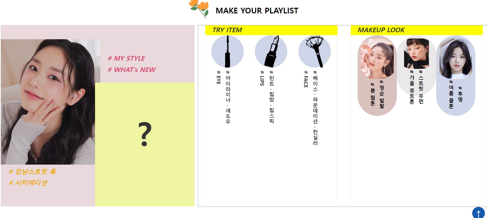
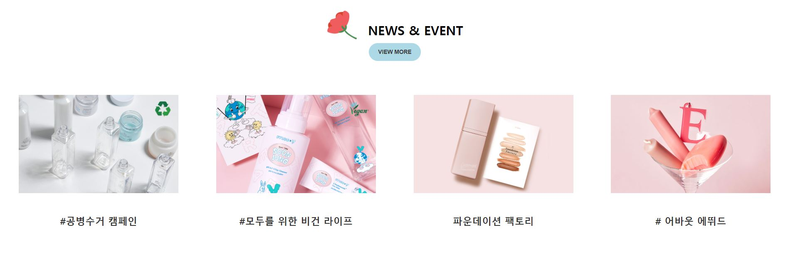
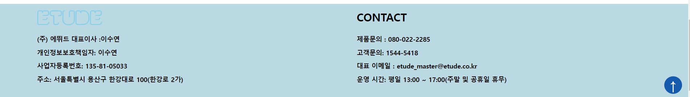
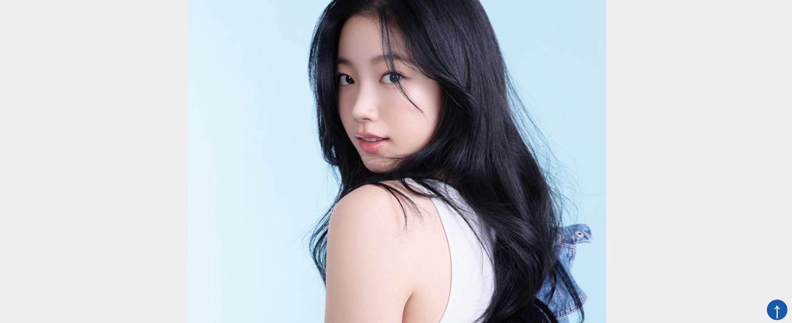
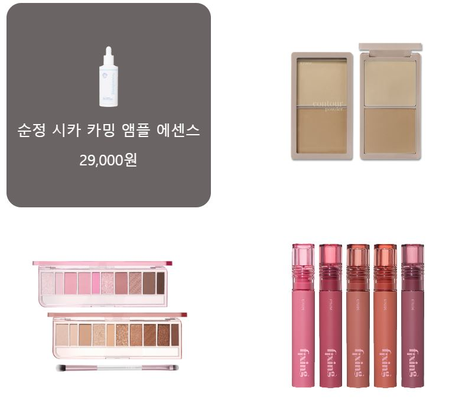
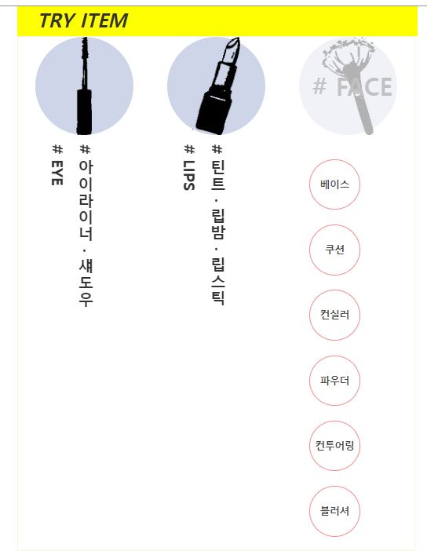
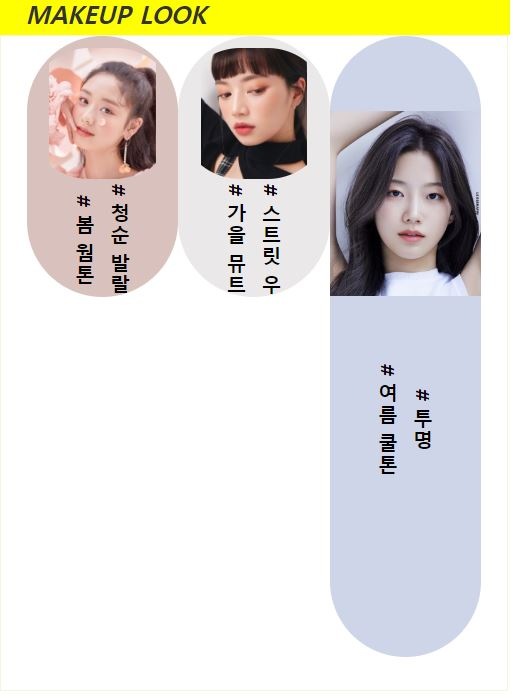

# 💄Etude 홈페이지 *redesign*   
에뛰드가 가지고 있던 기존의 이미지를 벗어나 새로운 이미지 컨셉을 제안하고 그에 맞게 홈페이지를 리뉴얼해보는 과제   
   🚀[페이지 방문하기](https://ggang89.github.io/academy_etude_redesign/)
### ✔ 리뉴얼 컨셉   
* 새로운 컨셉 : 맑음, 깨끗함, 순수함   
  * 코로나 이후 변화된 화장품 업계의 새로운 트렌드인 *비건 순수 환경친화적* 이미지를 강조
* 주색상 : 투명한 흰색   
  * 주 고객층인 화장 입문자, 초보자에 어울리고  **화장을 놀이처럼**한다는 기존의 에뛰드 컨셉을 연장하여 **흰바탕 위에 다양한 화장품으로 나만의 룩을 완성**한다는 새로운 놀이터를 제안함   

 ### ✔ 완성본   
🚀[페이지 방문하기](https://ggang89.github.io/academy_etude_redesign/)   

   

### ✔ 기능   
1. main page
   * 메뉴바 클릭시 해당 페이지로 이동(a태그 활용)   

   * 자동 화면 전환

   | 1| 2  |
   |:---:|:---:|
   | |   |    

2. 2page   
  * card 이벤트로 상세정보 제공   

       

3. 3page   
 * 동적 페이지 구성   
  * item에 horver시 상세 정보가 내려옴   

     || |
     |:---:|:---:|
  
  ### ✔기술스택   
  HTML, CSS, JQuery